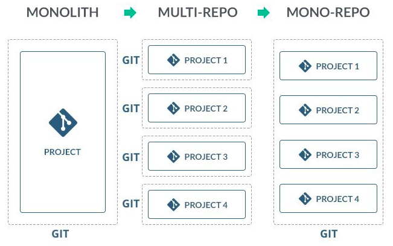
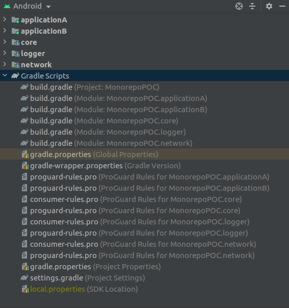
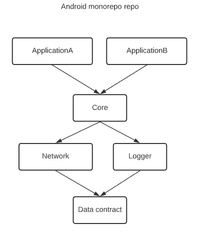
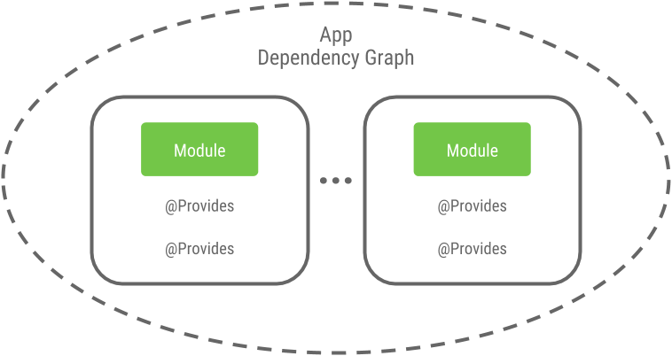
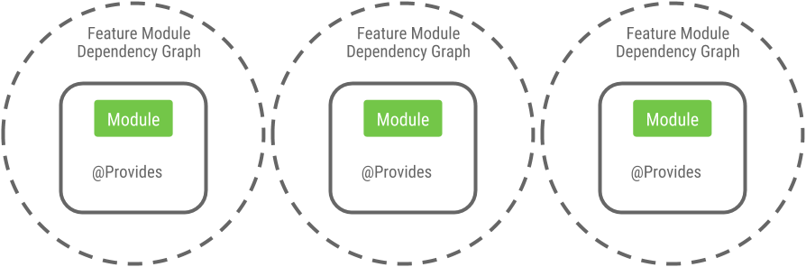
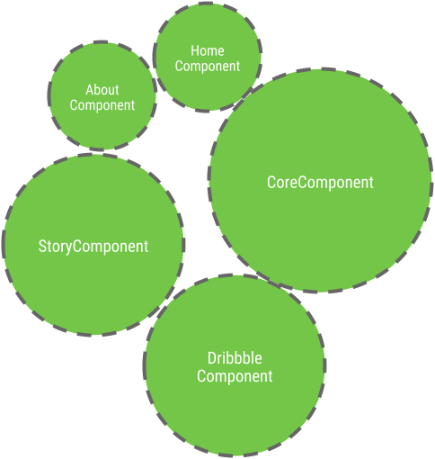
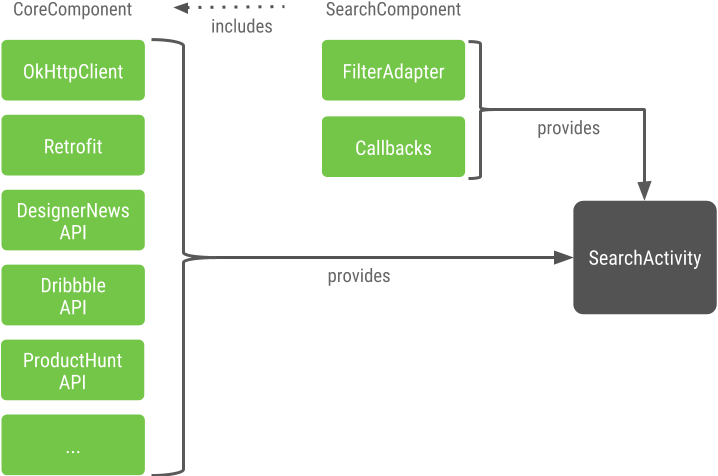

# MonorepoPOC

## Monolith to Monorepos



## Advantages
There are a number of potential advantages to a monorepo over individual repositories:

- **Ease of code reuse** – Similar functionality or communication protocols can be abstracted into shared libraries and directly included by projects, without the need of a dependency package manager.
- **Simplified dependency management** – In a multiple repository environment where multiple projects depend on a third-party dependency, that dependency might be downloaded or built multiple times. In a monorepo the build can be easily optimized, as referenced dependencies all exist in the same codebase.
- **Atomic commits** – When projects that work together are contained in separate repositories, releases need to sync which versions of one project work with the other. And in large enough projects, managing compatible versions between dependencies can become dependency hell. In a monorepo this problem can be negated, since developers may change multiple projects atomically.
- **Large-scale code refactoring** – Since developers have access to the entire project, refactors can ensure that every piece of the project continues to function after a refactor.
- **Collaboration across teams** – In a monorepo that uses source dependencies (dependencies that are compiled from source), teams can improve projects being worked on by other teams. This leads to flexible code ownership.

## Limitations and disadvantages

- **Loss of version information** – Although not required, some monorepo builds use one version number across all projects in the repository. This leads to a loss of per-project semantic versioning.
- **Lack of per-project access control** – With split repositories, access to a repository can be granted based upon need. A monorepo allows read access to all software in the project, possibly presenting new security issues. Note that there are versioning systems in which this limitation is not an issue. For example, when Subversion is used, it's possible to download any part of the repo (even a single directory), and path-based authorization can be used to restrict access to certain parts of a repository.
- **More storage needed by default** – With split repositories, you fetch only the project you are interested in by default. With a monorepo, you check out all projects by default. This can take up a significant amount of storage space. While all versioning systems have a mechanism to do a partial checkout, doing so defeats some of the advantages of a monorepo.

## Android Monorepo POC(flat modules)





## Implementation vs Api

- Dependencies appearing in the **api** configurations will be transitively exposed to consumers of the library, and as such will appear on the compile classpath of consumers. 

```
    api project(':logger')
```

- Dependencies found in the **implementation** configuration will, on the other hand, not be exposed to consumers, and therefore not leak into the consumers' compile classpath. 
```
    implementation project(':network')
```

## Dependency injection


### Plaid example: https://medium.com/androiddevelopers/dependency-injection-in-a-multi-module-project-1a09511c14b7

### Monolith dependency injection.
- Usually there’s one single dependency graph for the whole of the application.



### Monorepo dependency injection. 

- For a modularized app the simplified dependency graph usually looks kind of like this.



- More concrete, within Plaid the component landscape looks like this.



- How dependencies are provided to upper level modules

